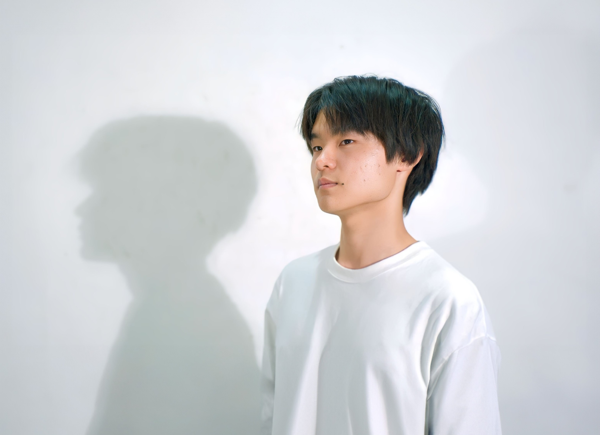

<!DOCTYPE html>
<html lang="en">
<head>
    <meta charset="UTF-8">
    <meta name="viewport" content="width=device-width, initial-scale=1.0">
    <title>Tomoda Yuki's Portfolio site</title>
    <link rel="stylesheet" href="css/reset.css">
    <link rel="stylesheet" href="css/style.css">
</head>
<body>
    <section class="header-wrapper">
        <header>
            

        </header>
        

            

        

        

            

        

    </section>
    <article>
        <section class="profile">
            <h1>PROFILE</h1>
            
            <h2 class="name">Tomoda Yuki</h2>
            
高校生の頃に「メディア技術を学んで人を楽しませられるクリエーターになりたい」と思いメディア工学を学べる大学に進学。大学二年生の時にUXデザインに出会いその楽しさを知る。2024年4月から、UI/UXデザインを実践できる企業でデザイナーとして働く予定。

        </section>
        <section class="works-wrapper">
            <h1>WORKS</h1>
            <section class="container">
                <a href="https://tomo07.github.io/PF_illuminate-work1/">
                    
                    <h2>DLsiteGames - アプリデザイン提案</h2>
                    
UI/UX/ロゴ　インターン課題

                </a>
                <a href="https://tomo07.github.io/PF_illuminate-work2/">
                    
                    <h2>私の推し部屋 - サービスデザイン提案</h2>
                    
UI/UX/ロゴ　卒業研究

                </a>
                <a href="https://tomo07.github.io/PF_illuminate-work3/">
                    
                    <h2>Quest eat - サービスデザイン提案</h2>
                    
UI/UX/ロゴ　授業課題

                </a>
                <a href="https://tomo07.github.io/PF_illuminate-work4/">
                    
                    <h2>ポートフォリオサイト ver.illuminate</h2>
                    
HTML/CSS　自主制作

                </a>
                <!-- <a href="https://ja.wikipedia.org/wiki/%E3%83%A1%E3%82%A4%E3%83%B3%E3%83%9A%E3%83%BC%E3%82%B8">
                    
                    <h2>DLsiteGames - アプリデザイン提案</h2>
                    
UI/UX/ロゴ

                </a> -->
                <!-- <a href="https://ja.wikipedia.org/wiki/%E3%83%A1%E3%82%A4%E3%83%B3%E3%83%9A%E3%83%BC%E3%82%B8">
                    
                    <h2>DLsiteGames - アプリデザイン提案</h2>
                    
UI/UX/ロゴ

                </a> -->
            </section>
        </section>
        <section class="works-wrapper">
            <h1 class="others">OTHERS</h1>
            <section class="container">
                <a href="https://tomo07.github.io/PF_illuminate-other1/">
                    
                    <h2>自己分析で見つけた３つの才能</h2>
                    
自己分析

                </a>
                <!-- <a href="https://ja.wikipedia.org/wiki/%E3%83%A1%E3%82%A4%E3%83%B3%E3%83%9A%E3%83%BC%E3%82%B8">
                    
                    <h2>DLsiteGames - アプリデザイン提案</h2>
                    
UI/UX/ロゴ

                </a>
                <a href="https://ja.wikipedia.org/wiki/%E3%83%A1%E3%82%A4%E3%83%B3%E3%83%9A%E3%83%BC%E3%82%B8">
                    
                    <h2>DLsiteGames - アプリデザイン提案</h2>
                    
UI/UX/ロゴ

                </a>
                <a href="https://ja.wikipedia.org/wiki/%E3%83%A1%E3%82%A4%E3%83%B3%E3%83%9A%E3%83%BC%E3%82%B8">
                    
                    <h2>DLsiteGames - アプリデザイン提案</h2>
                    
UI/UX/ロゴ

                </a> -->
                <!-- <a href="https://ja.wikipedia.org/wiki/%E3%83%A1%E3%82%A4%E3%83%B3%E3%83%9A%E3%83%BC%E3%82%B8">
                    
                    <h2>DLsiteGames - アプリデザイン提案</h2>
                    
UI/UX/ロゴ

                </a> -->
                <!-- <a href="https://ja.wikipedia.org/wiki/%E3%83%A1%E3%82%A4%E3%83%B3%E3%83%9A%E3%83%BC%E3%82%B8">
                    
                    <h2>DLsiteGames - アプリデザイン提案</h2>
                    
UI/UX/ロゴ

                </a> -->
            </section>
        </section>
    </article>
    <footer>
        

            <h1>CONTACT</h1>
            
tomoda.yuuki.5923@gmail.com

            
thank you!

        

    </footer>
</body>
</html>
